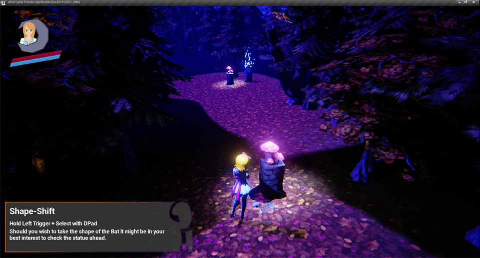
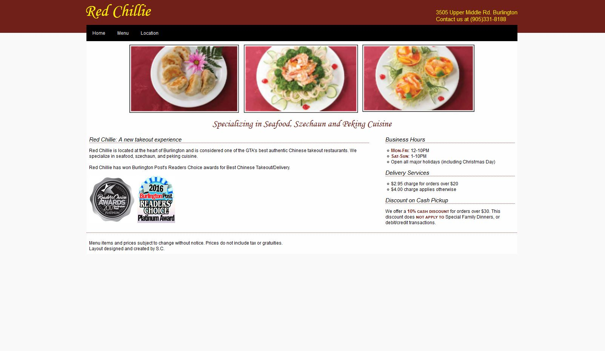

	
	
<a href="https://github.com/sachilds/Alice-Capstone">Project Alice</a>  <em>C++ w/ Unreal Engine 4</em>

	
	
<a href="https://github.com/sachilds/aichess">Chess</a>  <em>Java</em>

	
	
<a href="https://github.com/sachilds/PSO">Vanilla Particle Swarm Optimization</a>  <em>Java</em>

	
	
<a href="redchillie.html">Red Chillie Website</a>  <em>HTML/CSS</em>

