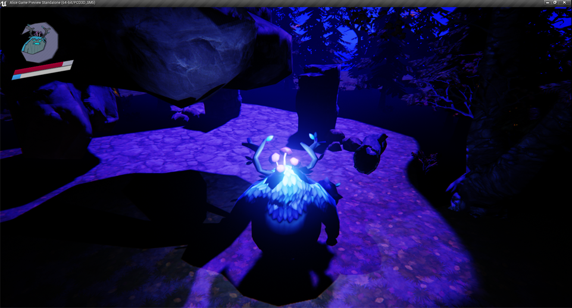

<h1>Projects</h1>
 

	
	
Alice?  <em>C++ & Unreal Engine</em>

 

 
  

	
	
Bob Lob the Blob  <em>C# & XNA</em>

 

 
  

	
	
Bob Lob the Blob 2 <em>C# & Unity</em>

 

 
  

	
	
Mushkingdom  <em>C# & Unity</em>

 

 
  

	
	
Passing Time <em>Java</em>

 

 
  

	
	
Rescue Longcat <em>Actionscript</em>

 

 
  

	
	
BHD Studio  <em>JavaFX</em>

 

 
  

	
	
N-Queens <em>Java</em>

 

 
  

	
	
Chess  <em>Java</em>

 

 
  

	
	
Genetic Algorithm <em>Java</em>

 

 
  

	
	
Vanilla PSO  <em>Java</em>

 

 
   

	
	
Database Program <em>MS Access</em>

 
